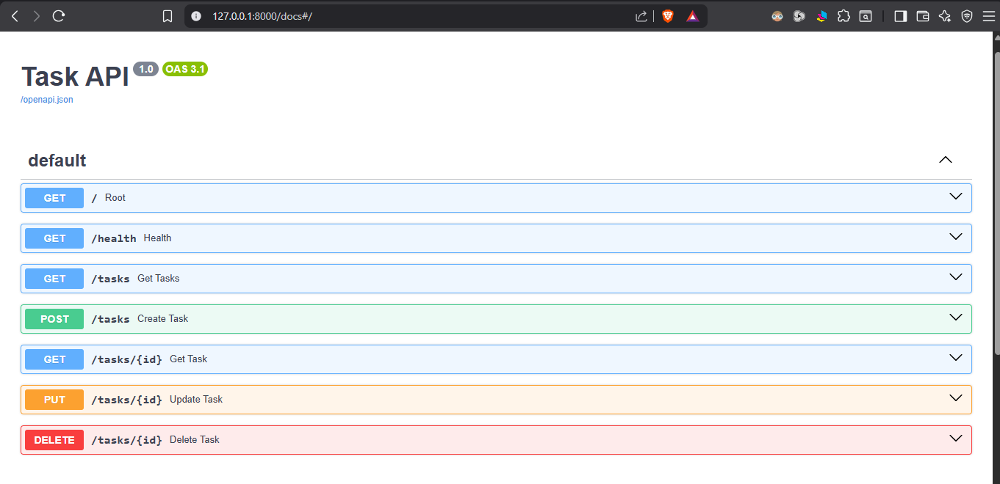

# Task API

A simple REST API built with **FastAPI** for managing tasks. This project demonstrates the basic CRUD (Create, Read, Update, Delete) operations using an in-memory list as the data store.

## Features

* List all tasks
* Get a task by ID
* Create a new task
* Update an existing task
* Delete a task
* Health check endpoint
* Interactive API documentation with Swagger UI

---

## Requirements

* Python 3.10+
* FastAPI
* Uvicorn

---

## Installation

Clone the repository:

```bash
git clone https://github.com/felicitytech/task-api.git
cd CRUD_in_FastAPI
```

Install dependencies:

```bash
pip install fastapi uvicorn
```

---

## Run the API

```bash
fastapi dev main.py
```

Or with Uvicorn:

```bash
uvicorn main:app --reload
```

The API will be available at:

```
http://127.0.0.1:8000
```

---

## Swagger Documentation

Interactive API documentation:

```
http://127.0.0.1:8000/docs
```

Alternative OpenAPI documentation:

```
http://127.0.0.1:8000/redoc
```

---

## API Endpoints

| Method | Endpoint      | Description      |
| ------ | ------------- | ---------------- |
| GET    | `/`           | API information  |
| GET    | `/health`     | Health check     |
| GET    | `/tasks`      | List all tasks   |
| GET    | `/tasks/{id}` | Get a task by ID |
| POST   | `/tasks`      | Create a task    |
| PUT    | `/tasks/{id}` | Update a task    |
| DELETE | `/tasks/{id}` | Delete a task    |

---

## Example Request

```bash
curl -i http://127.0.0.1:8000/tasks
```

Example output:

```http
HTTP/1.1 200 OK
content-type: application/json

[
  {
    "id": 1,
    "title": "Learn FastAPI",
    "done": false
  },
  {
    "id": 2,
    "title": "Build a REST API",
    "done": false
  },
  {
    "id": 3,
    "title": "Deploy the API",
    "done": false
  }
]
```

---

## Swagger Screenshot

Replace the image below with a screenshot of your Swagger UI.

```
docs/swagger.png
```

or

```markdown

<h2>Swagger UI</h2>


```

---

## Project Structure

```
task-api/
│
├── main.py
├── README.md
└── docs/
    └── swagger.png
```

---

## Author

Solomon Adegoke
